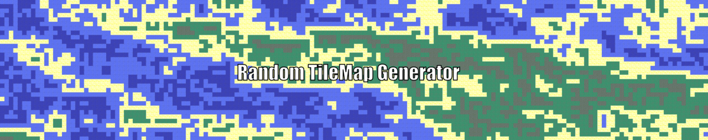

  

Program that creates a random tilemap from a set of tiles and some predefined rules.

Using a set of .png images (tiles) storaged in a directory named 'TileSet' and a set of rules specified on a 'MapRules.txt' file on the main directory, the program generates a image (named 'Map.png') formed by a grid of tiles from the TileSet directory. The final result is a randomized TileMap.

  

