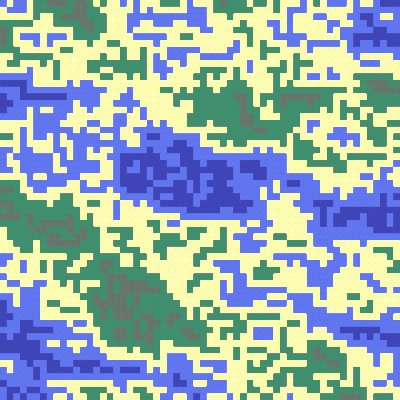

<p align="center">
  
</p>

Program that creates a random tilemap from a set of tiles and some predefined rules.

Using a set of .png images (tiles) storaged in a directory named 'TileSet' and a set of rules specified on a 'MapRules.txt' file on the main directory, the program generates a image (named 'Map.png') formed by a grid of tiles from the TileSet directory. The final result is a randomized TileMap.

A general 'MapRules.txt' file will look like this:
`MapRules.txt`
```
>Tile1
#NE,TileX,TileY,TileZ
#E,TileX,TileA,TileZ
#SE,TileX,TileZ
#S,TileY,TileZ
>Tile2
#NE,TileX,TileY,TileZ,...
#E,TileX,TileY,TileZ,...
#SE,TileX,TileY,TileZ,...
#S,TileX,TileY,TileZ,...
>Tile3
#NE,TileX,TileY,TileZ,...
...
```
Where 'Tile1', 'Tile2', 'Tile3', etc are the tile images names (TileX.png) on the TileSet directore. The syntax is as follows: For each tile name, one must write `>Tilename`, and bellow it, 4 subsections preceded by '#'. Each subsection corresponds to one cardinal direction (NE -> North East). After naming the direction, one must list the tiles that can be placed in that direction over the main Tile. In the given example, bellow Tile1 (#S) only the TileY and TileZ tiles can be placed, but not the TileA tile. Only NE, E, SE & S directions are needed.

Different TileSets (and rules) will generate different results:

<div align="center">
    <table >
     <tr>
        <td><b>Tile Set</b></td>
        <td><b>Results</b></td>
     </tr>
     <tr>
       <td>
            
      </td>
       <td>
            
      </td>
     </tr>
     <tr>
     <td>
            
      </td>
       <td>
            
      </td>
      </table>
  </div>

Needed libraries:
- random
- pygame
- os
       


