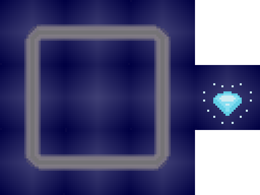
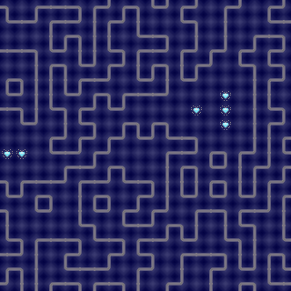

  

Program that creates a random tilemap from a set of tiles and some predefined rules.

Using a set of .png images (tiles) storaged in a directory named 'TileSet' and a set of rules specified on a 'MapRules.txt' file on the main directory, the program generates a image (named 'Map.png') formed by a grid of tiles from the TileSet directory. The final result is a randomized TileMap.

    <table >
     <tr>
        <td><b>Tile Set</b></td>
        <td><b>Results</b></td>
     </tr>
     <tr>
       <td>

            
      
<td>
       <td>

            
      
<td>
     </tr>
    </table>
    

    

